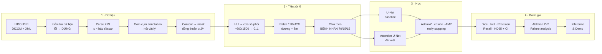
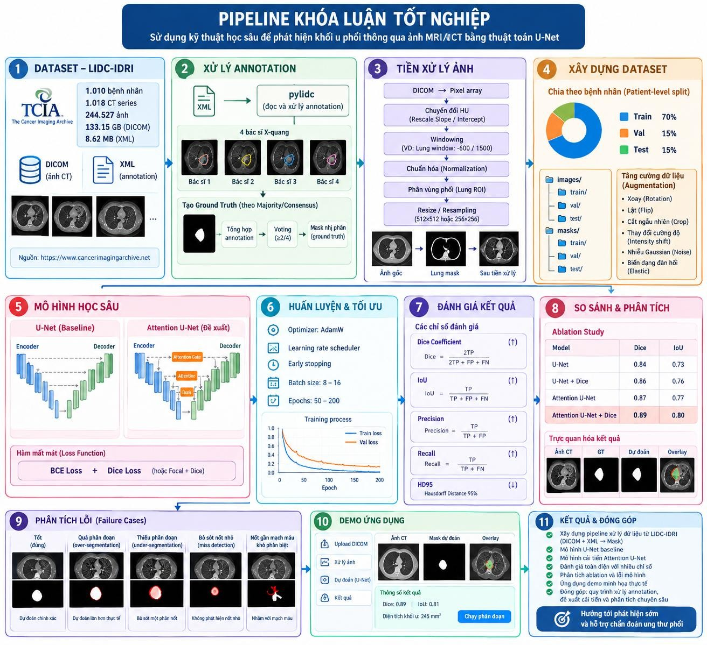
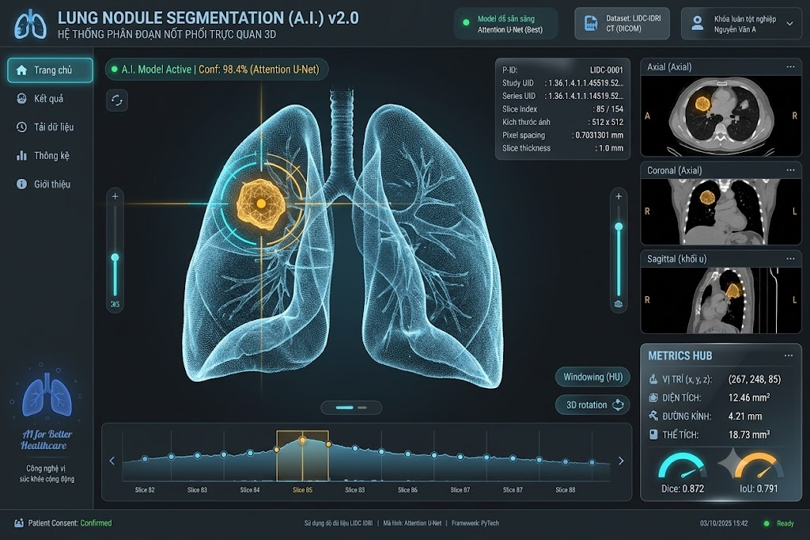
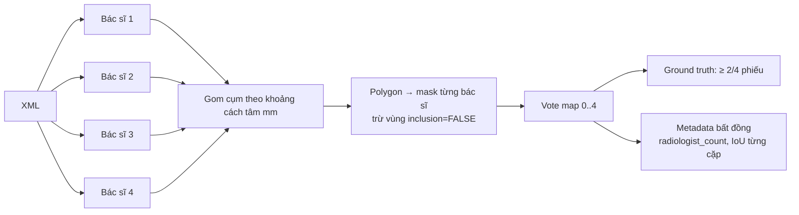

# 🫁 Lung Nodule Segmentation on CT with U-Net (LIDC-IDRI)

**Khóa luận tốt nghiệp:** *Ứng dụng kỹ thuật học sâu dựa trên kiến trúc U-Net để phát hiện và phân đoạn nốt phổi trên ảnh CT*


> [!IMPORTANT]
> Dự án **phân đoạn nốt phổi (lung nodule)** trên ảnh CT phục vụ nghiên cứu học thuật.
> Kết quả **không phải** chẩn đoán ung thư phổi, **không** phân loại lành tính hay ác tính và **không** dùng cho mục đích lâm sàng.

---

## Mục lục
1. [Tổng quan](#1-tổng-quan) · 2. [Mục tiêu nghiên cứu](#2-mục-tiêu-nghiên-cứu) · 3. [Dataset](#3-dataset) · 4. [Công nghệ sử dụng](#4-công-nghệ-sử-dụng) · 5. [Cài đặt](#5-cài-đặt) · 6. [Chuẩn bị dữ liệu](#6-chuẩn-bị-dữ-liệu) · 7. [Xử lý annotation](#7-xử-lý-annotation) · 8. [Tiền xử lý](#8-tiền-xử-lý) · 9. [Huấn luyện](#9-huấn-luyện) · 10. [Đánh giá](#10-đánh-giá) · 11. [Inference & demo](#11-inference--demo) · 12. [Thực nghiệm](#12-thực-nghiệm) · 13. [Kết quả](#13-kết-quả) · 14. [Hạn chế](#14-hạn-chế) · 15. [Đạo đức](#15-đạo-đức) · 16. [Tài liệu kỹ thuật](#16-tài-liệu-kỹ-thuật) · 17. [Cấu trúc repository](#17-cấu-trúc-repository) · 18. [Tiến độ](#18-tiến-độ) · 19. [Trích dẫn](#19-trích-dẫn)

---

## 1. Tổng quan

Bác sĩ chẩn đoán hình ảnh vẽ đường viền quanh nốt phổi trên từng lát CT. Dự án này huấn luyện mạng nơ-ron để **tự vẽ đường viền đó**: với mỗi pixel, mạng cho biết pixel đó có thuộc một nốt phổi hay không.

### Bốn khái niệm không được đánh đồng

| Khái niệm | Câu hỏi | Trong dự án? |
|-----------|---------|--------------|
| Nodule **detection** | Nốt nằm *ở đâu*? | Phụ (đánh giá thứ cấp) |
| Nodule **segmentation** | *Pixel nào* thuộc nốt? | **Chính** |
| Malignancy classification | Nốt *nghi ác tính* đến đâu? | Không |
| Lung cancer diagnosis | Bệnh nhân *có ung thư*? | Không |

### Pipeline



### Ý tưởng sơ đồ và giao diện demo

| Sơ đồ pipeline (bản phác thảo ý tưởng) | Mockup giao diện demo (bản phác thảo) |
|:---:|:---:|
|  |  |

> [!WARNING]
> Hai hình trên là **bản phác thảo ý tưởng**. Mọi con số trong hình (Dice, IoU, độ tin cậy, kích thước…) chỉ để **minh họa bố cục** và **không phải kết quả thực nghiệm**. Một số chi tiết trong mockup sẽ được sửa khi cài đặt (xem [docs/16](docs/16_demo_application.md) mục 2).

## 2. Mục tiêu nghiên cứu

1. Xây ground truth phân đoạn từ annotation của **nhiều bác sĩ** bằng majority voting, có lưu mức độ bất đồng.
2. Huấn luyện **U-Net** (baseline) và **Attention U-Net** (đề xuất) trong **cùng điều kiện**.
3. Đánh giá bằng Dice, IoU, Precision, Recall, HD95, có khoảng tin cậy và kiểm định thống kê, trên tập test **chia theo bệnh nhân**.
4. Ablation (kiến trúc × loss), phân tích lỗi theo kích thước, đậm độ, vị trí nốt và so với mức đồng thuận giữa các bác sĩ.

**Câu hỏi nghiên cứu:** RQ1: attention gate có cải thiện phân đoạn không? · RQ2: BCE + Dice có tốt hơn BCE không? · RQ3: hiệu năng thay đổi thế nào theo kích thước nốt và mức đồng thuận giữa các bác sĩ? Chi tiết giả thuyết H1–H6 ở [docs/11](docs/11_experiment_plan.md).

## 3. Dataset

**LIDC-IDRI** (The Cancer Imaging Archive). Các số liệu dưới đây đã được đối chiếu với TCIA và Armato et al. (2011):

| | |
|---|---|
| Bệnh nhân | 1,010 |
| Case CT | 1,018 |
| Ảnh / dung lượng | 244,527 / 133.16 GB |
| Annotation | XML, 4 bác sĩ mỗi case, đọc 2 pha (blinded → unblinded) |
| Giấy phép | CC BY 3.0, **bắt buộc trích dẫn** |

Chỉ nốt **≥ 3 mm** có contour. Trường `malignancy` là đánh giá chủ quan của bác sĩ, **không** được dùng làm nhãn ung thư. Chi tiết ở [docs/03](docs/03_dataset_specification.md).

## 4. Công nghệ sử dụng

| Nhóm | Công nghệ | Vai trò |
|------|-----------|---------|
| Ngôn ngữ | **Python 3.11** | |
| Deep learning | **PyTorch 2.5** (CUDA 12.4, AMP) | Model, huấn luyện |
| Ảnh y tế | **pydicom** | Đọc DICOM |
| Xử lý ảnh / khoa học | **NumPy, SciPy, scikit-image** | HU, polygon → mask, morphology, HD95 |
| Dữ liệu | **pandas** | Metadata, kết quả |
| Cấu hình | **PyYAML** | Config kế thừa `_base_`, override bằng `--set` |
| Theo dõi thí nghiệm | **TensorBoard**, CSV/JSON | Curves, lịch sử, tổng hợp kết quả |
| Trực quan hóa | **matplotlib** | Overlay, curves, failure cases |
| Kiểm thử | **pytest** | Unit test |
| Demo | **Gradio** (dự kiến) | Giao diện minh họa |
| Đối chiếu | pylidc (tùy chọn) | Kiểm tra chéo mask |
| Phần cứng phát triển | NVIDIA RTX 3050 Laptop 4 GB | Quyết định model 2D, patch 128, base 32 kênh |

> Version chính xác của từng package được chốt ở PHASE 01 (`requirements.txt`, `requirements-lock.txt`).

## 5. Cài đặt

```bash
git clone https://github.com/TruongTanNghia/Project_KhoaLuan-Ha.git
cd Project_KhoaLuan-Ha
python -m venv .venv
.venv\Scripts\activate            # Windows   |   source .venv/bin/activate  (Linux/macOS)
pip install -r requirements.txt
python scripts/00_check_project.py   # kiểm tra cấu trúc + config → "PHASE 00 VALID"
pytest                               # unit test
```

## 6. Chuẩn bị dữ liệu

1. Tải LIDC-IDRI từ TCIA bằng **NBIA Data Retriever**.
2. Đặt dữ liệu vào `data/raw/LIDC-IDRI/` **hoặc** khai báo đường dẫn:
   ```powershell
   $env:LIDC_IDRI_DIR = "D:\datasets\LIDC-IDRI"          # Windows PowerShell
   ```
   ```bash
   export LIDC_IDRI_DIR=/data/LIDC-IDRI                   # Linux/macOS
   ```
3. Kiểm tra dữ liệu *(PHASE 02)*: `python scripts/01_validate_raw_data.py --config configs/base.yaml`. Gặp lỗi chặn thì pipeline **dừng**.

## 7. Xử lý annotation

*(PHASE 04–07)* `python scripts/02_parse_annotations.py` → `python scripts/03_generate_masks.py`



Lý do chọn majority ≥ 2/4 thay vì union, intersection hay STAPLE: xem [docs/04](docs/04_annotation_pipeline.md).

## 8. Tiền xử lý

*(PHASE 08–13)*

| Bước | Mặc định | Ghi chú |
|------|----------|---------|
| HU | `pixel × slope + intercept`, clip [−1024, 3071] | Xử lý pixel padding |
| Window | Cửa sổ phổi WL −600 / WW 1500 | |
| Normalize | Min–max theo cửa sổ cố định → [0, 1] | Không chuẩn hóa theo từng ảnh |
| Lung ROI | Ngưỡng + closing | Chỉ dùng để chọn vị trí lấy mẫu và lọc FP; **không** xóa pixel (tránh mất nốt sát màng phổi) |
| Patch | 128 × 128, jitter ±16 px, 1 âm : 1 dương | **Không** resize toàn lát (nốt 3 mm sẽ biến mất) |
| Split | **Theo bệnh nhân** 70/15/15, phân tầng theo kích thước nốt | Có kiểm tra rời nhau tự động |
| Augmentation | Lật ngang, xoay ±15°, scale ±10% | Không dùng elastic (làm biến dạng hình thái nốt) |

## 9. Huấn luyện

*(PHASE 14–18)*

```bash
python scripts/06_train_unet.py           --config experiments/exp01_unet_baseline/config.yaml --set project.seed=42
python scripts/07_train_attention_unet.py --config experiments/exp04_attention_unet_dice/config.yaml
```

AdamW (lr 3e-4) · cosine annealing · AMP · batch 16 · early stopping theo `val_dice` (patience 15) · checkpoint `best` + `last` · TensorBoard + `history.csv`. Mọi tham số nằm trong [`configs/base.yaml`](configs/base.yaml).

| Model | Tham số (ước lượng từ bản phác thảo) |
|-------|------------------------------------|
| U-Net (base 32, depth 4) | ≈ 7.76 M |
| Attention U-Net | ≈ 7.85 M (+ khoảng 1.1%) |

## 10. Đánh giá

*(PHASE 19–21)* `python scripts/08_evaluate.py --config <exp config>`

- **Đơn vị chính: theo nốt** (3D). Metric: **Dice, IoU, Precision, Recall, HD95 (mm)**.
- CI 95% bootstrap theo bệnh nhân; Wilcoxon signed-rank theo cặp + Holm.
- Mốc tham chiếu: mức đồng thuận giữa các bác sĩ trên cùng tập test.
- Phát hiện thứ cấp: per-nodule sensitivity và FP/scan khi chạy trên toàn lát.

Chi tiết ở [docs/10](docs/10_evaluation_protocol.md).

## 11. Inference & demo

*(PHASE 22–23)*

```bash
python scripts/09_inference.py --config experiments/exp04_attention_unet_dice/config.yaml --input <dicom_series_dir>
python app/app.py
```

Demo (Gradio) gồm lát axial + overlay, 3 mặt cắt, bảng số đo tính từ mask, và **luôn hiển thị disclaimer**. Dice/IoU chỉ hiển thị với ca có ground truth. Xem [docs/16](docs/16_demo_application.md).

## 12. Thực nghiệm

Thiết kế giai thừa **2 × 2** (mỗi ô × 3 seed):

|                     | BCE    | BCE + Dice |
|---------------------|--------|------------|
| **U-Net**           | EXP-01 | EXP-02     |
| **Attention U-Net** | EXP-03 | EXP-04 *(đề xuất)* |

Ablation bổ sung: augmentation on/off (ABL-A), đa cửa sổ HU (ABL-B). `scripts/00_check_project.py` **tự động báo lỗi** nếu các experiment khác nhau ở bất kỳ điểm nào ngoài kiến trúc và loss. Xem [docs/11](docs/11_experiment_plan.md) và [docs/12](docs/12_ablation_study.md).

## 13. Kết quả

**Chưa có kết quả.** Bảng dưới được sinh tự động từ `results/metrics/experiments_summary.csv` sau PHASE 19–20 và **không bao giờ điền tay**.

| Experiment | Dice | IoU | Precision | Recall | HD95 (mm) |
|------------|------|-----|-----------|--------|-----------|
| — | — | — | — | — | — |

## 14. Hạn chế

- Model 2D; không khai thác ngữ cảnh 3D (dễ nhầm mạch máu với nốt).
- Ground truth là đồng thuận của bác sĩ, không có xác nhận giải phẫu bệnh; bất đồng giữa các bác sĩ đáng kể.
- Huấn luyện theo patch quanh nốt: Dice trên patch lạc quan hơn bài toán tự tìm nốt trên toàn scan.
- Chỉ dùng LIDC-IDRI, chưa có external validation (có domain shift so với dữ liệu bệnh viện khác).
- GPU 4 GB giới hạn kích thước model và batch size.

Đầy đủ ở [docs/15](docs/15_ethics_and_limitations.md).

## 15. Đạo đức

Dữ liệu đã khử định danh, dùng theo CC BY 3.0 và có trích dẫn. Ảnh y tế **không** được commit lên repository. Không có số liệu giả: mọi kết quả sinh từ pipeline. Đây là nguyên mẫu nghiên cứu, **không** phải thiết bị y tế.

## 16. Tài liệu kỹ thuật

Bộ tài liệu đầy đủ nằm trong [`docs/`](docs/README.md). Mọi nhận định được gắn nhãn **FACT / ASSUMPTION / DECISION / HYPOTHESIS / RESULT / LIMITATION**.

| # | Tài liệu | # | Tài liệu |
|---|----------|---|----------|
| 00 | [Project overview](docs/00_project_overview.md) | 11 | [Experiment plan](docs/11_experiment_plan.md) |
| 01 | [Problem definition](docs/01_problem_definition.md) | 12 | [Ablation study](docs/12_ablation_study.md) |
| 02 | [Literature review](docs/02_literature_review.md) | 13 | [Failure analysis](docs/13_failure_analysis.md) |
| 03 | [Dataset specification](docs/03_dataset_specification.md) | 14 | [Reproducibility](docs/14_reproducibility.md) |
| 04 | [Annotation pipeline](docs/04_annotation_pipeline.md) | 15 | [Ethics & limitations](docs/15_ethics_and_limitations.md) |
| 05 | [Preprocessing pipeline](docs/05_preprocessing_pipeline.md) | 16 | [Demo application](docs/16_demo_application.md) |
| 06 | [Dataset construction](docs/06_dataset_construction.md) | 17 | [Results template](docs/17_results_template.md) |
| 07 | [U-Net baseline](docs/07_unet_baseline.md) | 18 | [Thesis structure](docs/18_thesis_structure.md) |
| 08 | [Proposed model](docs/08_proposed_model.md) | 19 | [Defense questions](docs/19_defense_questions.md) |
| 09 | [Training strategy](docs/09_training_strategy.md) | 20 | [Roadmap & quality gates](docs/20_roadmap_and_quality_gates.md) |
| 10 | [Evaluation protocol](docs/10_evaluation_protocol.md) | — | [Data assumptions](docs/DATA_ASSUMPTIONS.md) · [Phase tracker](docs/PHASES.md) |

**Đọc theo mục đích:** triển khai → 03, 04, 05, 06, 07, 09, 10, 14 · viết khóa luận → 00, 01, 02, 18 · chuẩn bị bảo vệ → 19, 15, 12, 10.

## 17. Cấu trúc repository

```
├── configs/            base.yaml · unet.yaml · attention_unet.yaml
├── data/               raw/ · interim/ · processed/ · splits/   (ảnh không commit)
├── docs/               tài liệu kỹ thuật 00–20 + assets/
├── src/
│   ├── data/           validator · dicom_loader · xml_parser · annotation_processor
│   │                   mask_generator · hu_converter · preprocessing · dataset_split
│   ├── datasets/       lung_nodule_dataset
│   ├── models/         unet · attention_unet · model_factory
│   ├── losses/         bce · dice · combined
│   ├── metrics/        dice · iou · precision · recall · hd95
│   ├── training/       trainer · optimizer · scheduler · early_stopping
│   ├── evaluation/     evaluator · visualization · failure_analysis
│   ├── inference/      predict
│   └── utils/          io (config) · logger · seed · checkpoint
├── scripts/            00_check_project … 09_inference  (đánh số theo thứ tự pipeline)
├── experiments/        exp01 … exp04  (config + vết thí nghiệm sinh tự động)
├── results/            metrics · curves · predictions · overlays · failure_cases
├── notebooks/          khám phá/trình bày, import từ src/
├── tests/              pytest
└── app/                demo
```

**Nguyên tắc:** code chính nằm trong `src/`, scripts chỉ điều phối; không hard-code đường dẫn hay hyperparameter; mọi run lưu config, seed, git commit và môi trường.

## 18. Tiến độ

Dự án triển khai tuần tự qua **24 phase** (PHASE 00–23), mỗi phase phải qua *quality gate* mới được đi tiếp.
Mỗi phase là một Issue (PHASE *NN* = issue #*NN+1*); các việc viết khóa luận và bảo vệ là issue #25–#31.
👉 **Roadmap tổng: [issue #32](https://github.com/TruongTanNghia/Project_KhoaLuan-Ha/issues/32)** · [Danh sách Issues](https://github.com/TruongTanNghia/Project_KhoaLuan-Ha/issues) · [Milestones R1–R12](https://github.com/TruongTanNghia/Project_KhoaLuan-Ha/milestones)

| Giai đoạn | Phase | Trạng thái |
|-----------|-------|------------|
| Khởi tạo | 00 | ✅ |
| Môi trường | 01 | ⏳ |
| Dữ liệu & annotation | 02–07 | ⏳ |
| Tiền xử lý & dataset | 08–13 | ⏳ |
| Model & huấn luyện | 14–18 | ⏳ |
| Đánh giá & phân tích | 19–21 | ⏳ |
| Inference & demo | 22–23 | ⏳ |

Chi tiết ở [docs/PHASES.md](docs/PHASES.md) và [docs/20](docs/20_roadmap_and_quality_gates.md).

## 19. Trích dẫn

Bắt buộc theo yêu cầu của TCIA:

```bibtex
@misc{armato2015lidcdata,
  author    = {Armato III, S. G. and McLennan, G. and Bidaut, L. and McNitt-Gray, M. F. and Meyer, C. R. and Reeves, A. P. and others},
  title     = {Data From LIDC-IDRI},
  year      = {2015},
  publisher = {The Cancer Imaging Archive},
  doi       = {10.7937/K9/TCIA.2015.LO9QL9SX}
}
@article{armato2011lidc,
  author  = {Armato III, S. G. and McLennan, G. and Bidaut, L. and others},
  title   = {The Lung Image Database Consortium ({LIDC}) and Image Database Resource Initiative ({IDRI}): A Completed Reference Database of Lung Nodules on {CT} Scans},
  journal = {Medical Physics}, volume = {38}, number = {2}, pages = {915--931}, year = {2011},
  doi     = {10.1118/1.3528204}
}
@article{clark2013tcia,
  author  = {Clark, K. and Vendt, B. and Smith, K. and others},
  title   = {The Cancer Imaging Archive ({TCIA}): Maintaining and Operating a Public Information Repository},
  journal = {Journal of Digital Imaging}, volume = {26}, number = {6}, pages = {1045--1057}, year = {2013},
  doi     = {10.1007/s10278-013-9622-7}
}
```

Phương pháp:

```bibtex
@inproceedings{ronneberger2015unet,
  author = {Ronneberger, O. and Fischer, P. and Brox, T.},
  title = {U-Net: Convolutional Networks for Biomedical Image Segmentation},
  booktitle = {MICCAI}, year = {2015}, doi = {10.1007/978-3-319-24574-4_28}
}
@inproceedings{oktay2018attention,
  author = {Oktay, O. and Schlemper, J. and Le Folgoc, L. and others},
  title = {Attention U-Net: Learning Where to Look for the Pancreas},
  booktitle = {MIDL}, year = {2018}, note = {arXiv:1804.03999}
}
```

## License

Mã nguồn: MIT (xem [LICENSE](LICENSE)). Dữ liệu LIDC-IDRI thuộc điều khoản riêng của TCIA (CC BY 3.0) và **không** nằm trong repository.
